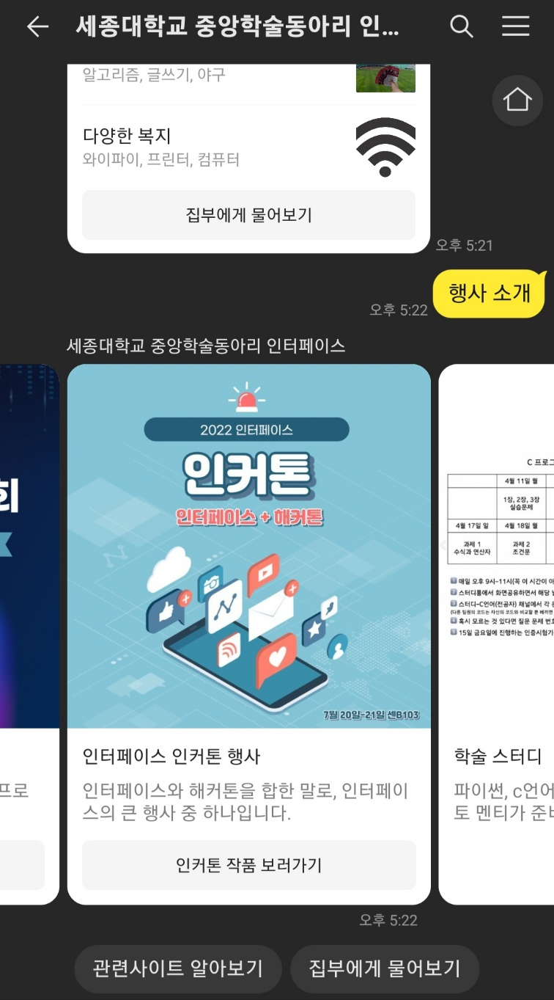
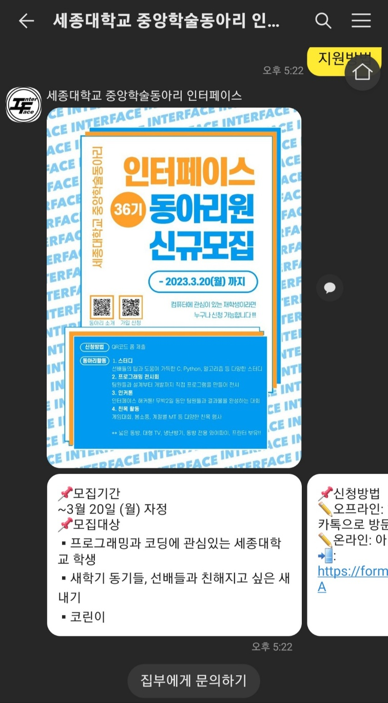
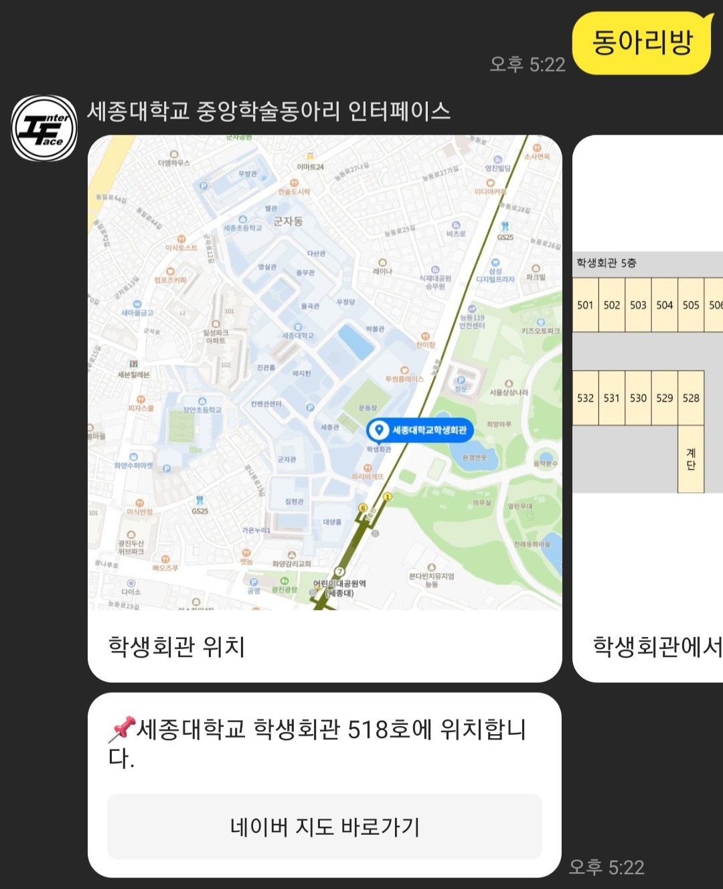
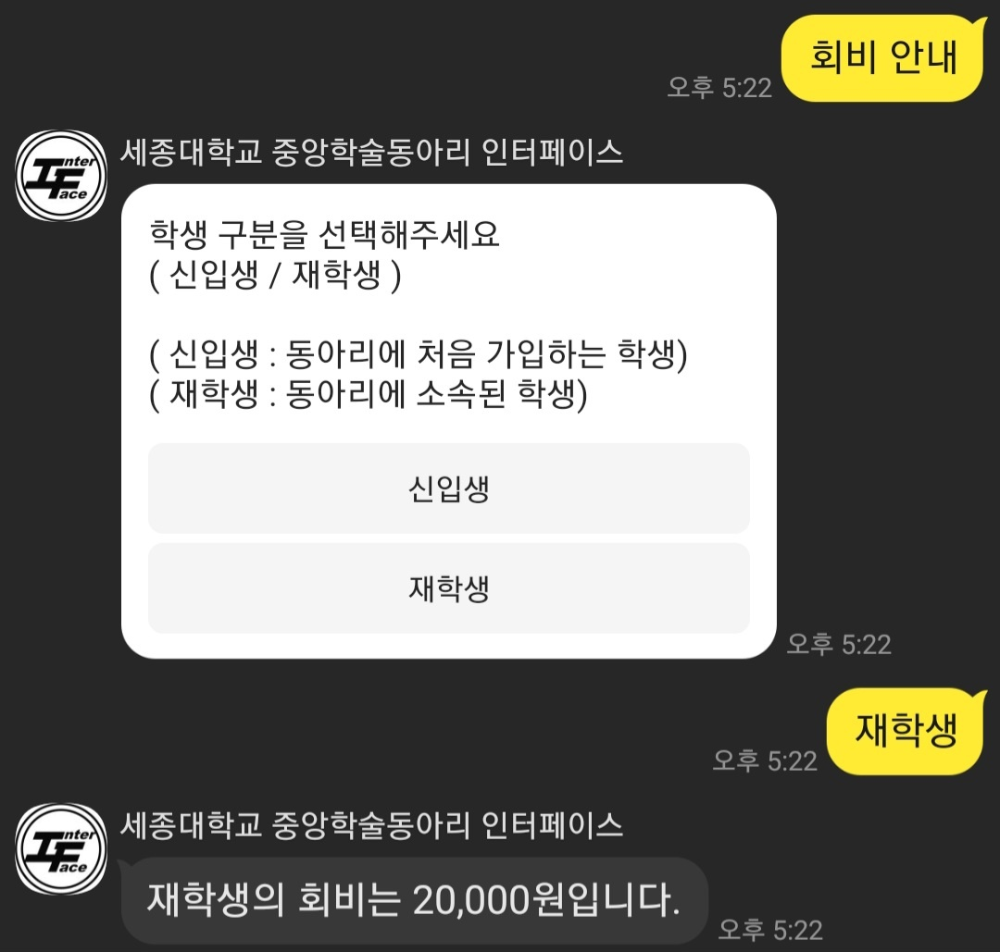
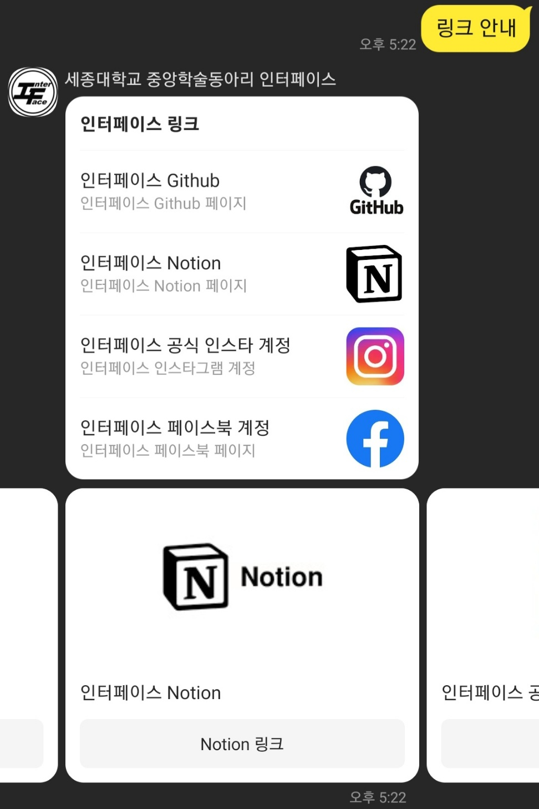
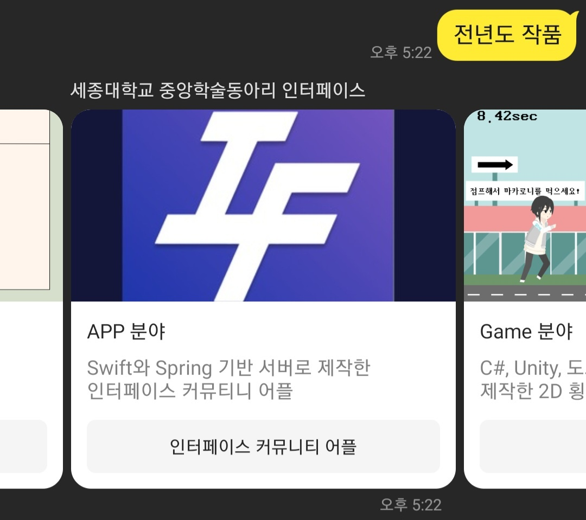
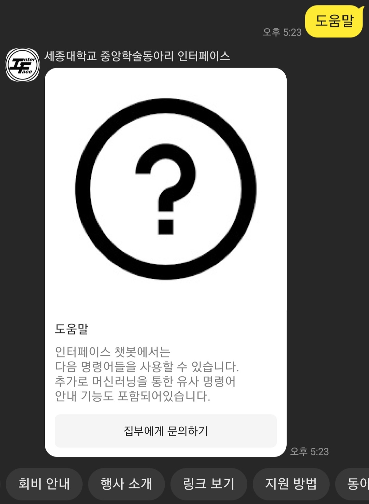

# 인터페이스 챗봇 리팩토링

### 팀원
- 박상욱 (인터페이스 31기 전자정보통신공학과)
- 김건민 (인터페이스 35기 소프트웨어학과)
- 김소희 (인터페이스 35기 데이터사이언스학과)

### 리팩토링 목적
1. 기존 인터페이스 챗봇의 경우 동아리 서버로 운영하는데 어려움이 있음
2. 사용 기능이 한정적이며 Flask로 구현 시 기능의 디자인적 요소를 구현하는 것이 복잡함
3. 시나리오로 기능을 구현하는 경우 디자인이 직관적이며 스킬 서버가 필요없음

### 리팩토링 기능
<table align="center">
  <tr align="center">
    <td width="250">
       
      동아리 소개
    </td>
    <td width="250">
       
      행사 소개
    </td>
    <td width="250">
       
      지원방법
    </td>
    <td width="250">
       
      동아리방
    </td>
</table>
<table align="center">
  <tr align="center">
    <td width="250">
       
      회비 안내
    </td>
    <td width="250">
       
      링크 안내
    </td>
    <td width="250">
       
      전년도 작품
    </td>
    <td width="250">
       
      로그인 화면
    </td>
</table>
